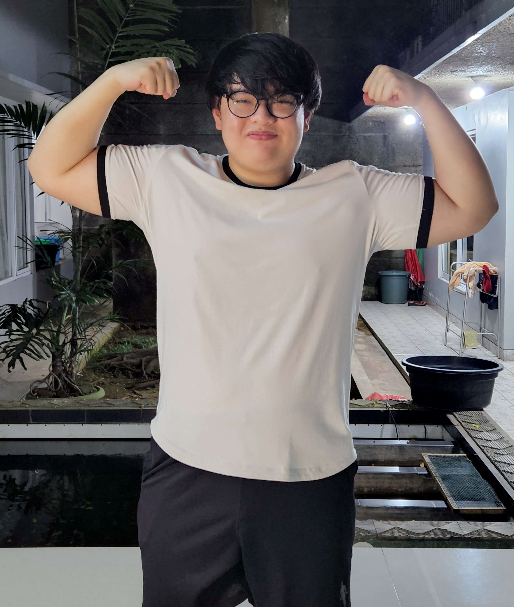

# Gary Cruise Profile

> This is an assigment for "My Profile"

## My BIO



Hello, My name is Gary Cruise. Student of RevoU FSSE program.

Currently working as Marketing & General Manager in Batik Sutra Putih.

I'm a beginner in Coding and Web Developer program.

My main goal is to finish RevoU Software Enginnering program, have a career switch & take Master Degree in Computer Science.

## My Links

- Github: [@Garycruisee](https://github.com/Garycruisee)
- LinkedIn: [Gary Cruise](https://www.linkedin.com/in/gary-cruise-618654255/)
- Instagram: [onionsoup_0](https://www.instagram.com/onionsoup_0/)

## My Technical Skills

1. Code Editor & VSCode
2. Aabbcc
3. 😊

## My Favorite Websites

| Name    | URL                   | Reason                         |
| ------- | --------------------- | ------------------------------ |
| Google  | <https://google.com>  | To search anything             |
| Instragram | <https://https://www.instagram.com/> | To stalk people 😊      |  

## My Code Examples

### Markdown

```markdown
# Hello World

My name is Gary Cruise! 😊
```

### HTML

```html
<main class="content">
  <h1>Hello World</h1>
  <p>My name is Gary Cruise! 😊</p>
</main>
```

### CSS

```css
.content {
  color: rgb(0,255,130);
  font-size: 1.2rem;
}
```

### JavaScript

```js
const text = "Hello World";
console.log(text);
```

### TypeScript

```js
const text: string = "Hello World";
console.log(text);
```